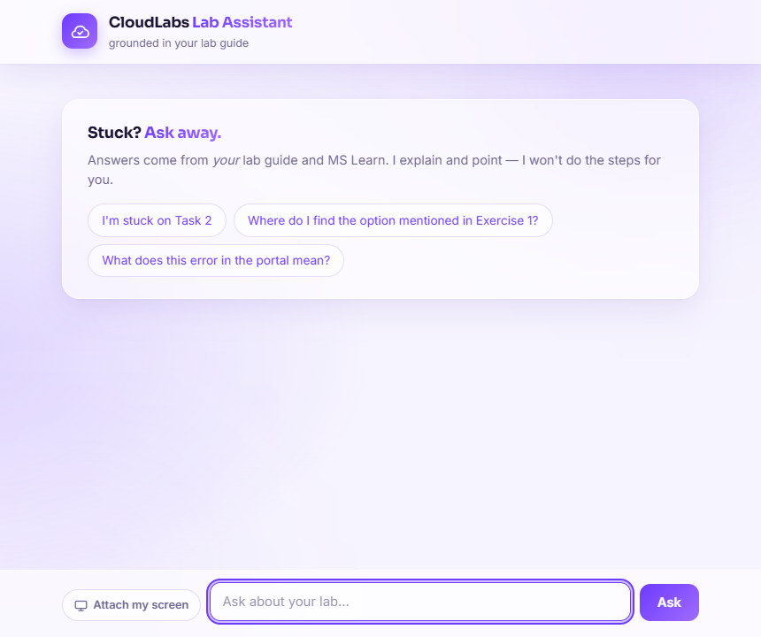
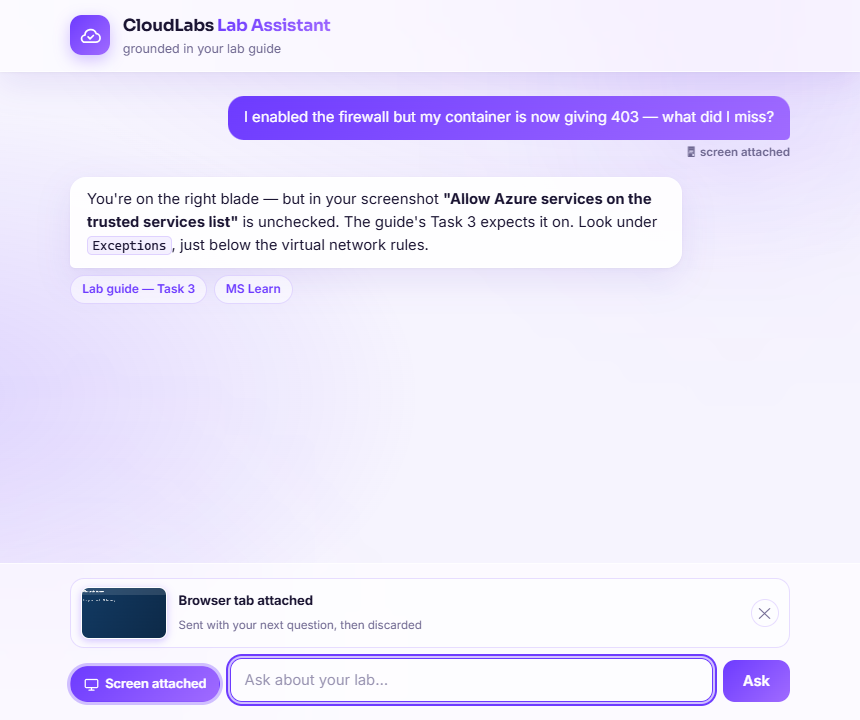
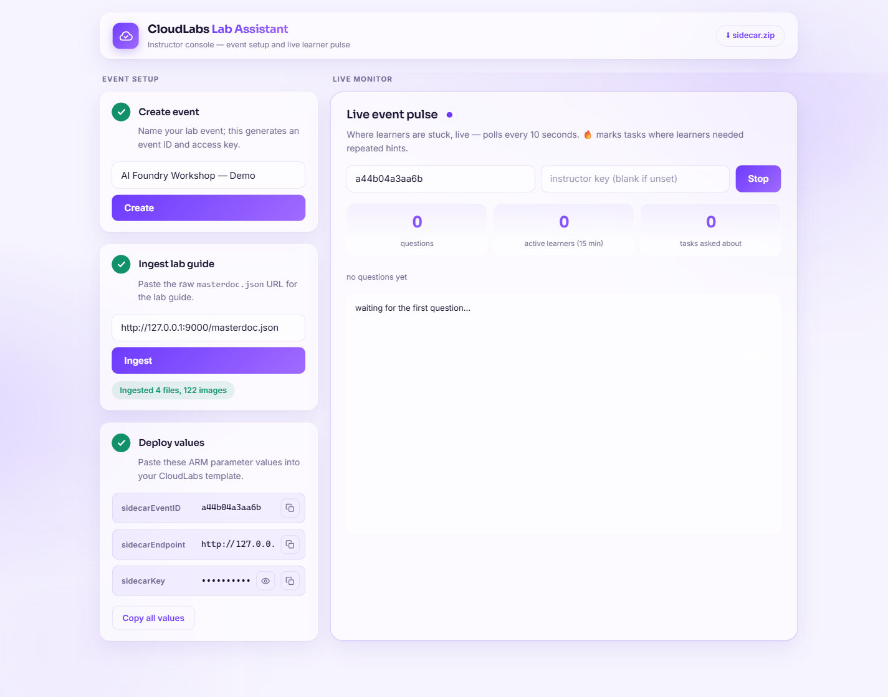

<div align="center">

# ☁️ CloudLabs Lab Assistant

**A tutor inside every lab VM — grounded in the lab's own guide, incapable of doing the lab for the learner.**

*It nudges. It points. It never hands over the answer sheet.*


</div>

---

## The gap

Every hands-on lab has the same failure mode: a learner hits a wall at Task 3,
there's no proctor in the room — or it's 11pm — and the lab gets abandoned.
Support tickets pile up on questions the lab guide already answers, and
instructors find out which task was broken *after* the event, not during it.

This project closes that gap with two moving parts:

| Component | What it is | Runs where |
|---|---|---|
| **Sidecar agent** (`sidecar/`) | A single static Go binary with an embedded chat UI | Inside every learner VM |
| **Orchestrator** (`orchestrator/`) | FastAPI service: instructor portal, guide ingestion, Q&A brain, live analytics | Azure App Service (or local) |

The full design rationale lives in `docs/superpowers/specs/sidecar-agent-design.md`.

---

## The learner's side

One desktop shortcut, zero setup. The agent answers from the ingested lab
guide plus MS Learn — and refuses, structurally, to do the work itself.

<p align="center">
  
</p>

### 🎯 Graduated hinting — enforced, not vibes

Asks are counted per learner, per task. The first ask gets a conceptual
nudge; the second, a narrower pointer; the third onward, a full step
reference with reasoning — but **never** resolved `<inject .../>` values or a
copy-pasteable solution. Three layers keep it honest:

1. The hint ladder is computed server-side from the ask counter — the model
   can't be sweet-talked past it.
2. A cheap second LLM pass classifies every draft as **PERFORM** or
   **POINT**; PERFORM drafts are regenerated once.
3. A hard post-filter strips `<inject .../>` tags from answers regardless of
   what the model produced.

### 🖥️ Show, don't describe — screen capture done right

Click **Attach my screen** and the browser's native picker opens — the
learner chooses a tab, a window, or the whole screen. Exactly one frame is
grabbed (never a live share), and a preview tray shows precisely what will be
sent before anything leaves the machine. One click on ✕ discards it.

<p align="center">
  
</p>

With a screen in hand the model doesn't just answer — it compares where the
learner *actually is* against where the guide says they should be, and calls
out "you're on the wrong blade" before explaining anything. In embedded
webviews without `getDisplayMedia`, the agent falls back to a one-shot
capture of the VM's primary display, clearly labeled in the same tray.

### 📚 Grounded first, deepened when needed

Every answer starts from the ingested guide and MS Learn search excerpts.
When neither covers the question — or the Azure portal has drifted from the
guide's steps — the model emits a `LEARN_MORE: <query>` marker. The
orchestrator fetches the **full article** from `learn.microsoft.com` (hard
domain allowlist), re-answers from it once — metered, never looping — and the
marker never reaches the learner. Answers can also embed an **annotated guide
screenshot** pointing at the exact control, click-to-zoom.

---

## The instructor's side

<p align="center">
  
</p>

### 🔍 Ingest once, run forever

**Preview** parses the masterdoc and shows the exact ordered file list before
a single byte is fetched — only `Files[]` entries, never the rest of the
repo. After **Confirm & Ingest**, the enriched guide is cached by content
hash: the same lab for a new cohort re-ingests instantly at zero captioning
cost, and an updated guide is detected and re-ingested automatically.

### 📊 A live pulse, not a post-mortem

The portal polls analytics every 10 seconds during the event: headline
numbers, a per-task bar list (🔥 marks tasks where learners needed repeated
hints), and a recent-questions feed. Task refs, questions, and hint levels
are stored — **answers and screenshots never are**.

### 🔒 Abuse-proof by construction

The event key ships in plaintext on learner VMs, so the API assumes it will
leak and gates *before* spending tokens: per-learner sliding-window rate
limits (HTTP 429), a per-event token budget (HTTP 402), and a prompt layout
ordered static-rules → guide → per-request content so Azure OpenAI's prompt
cache keeps every learner in an event sharing one cached guide prefix.

---

## Quickstart (local, no Azure required)

> Real answers need an Azure OpenAI chat deployment (e.g. `gpt-5.2`). The
> portal, events, and ingestion all work with **no credentials at all** —
> captioning is simply skipped.

**Prerequisites:** Python 3.11+ · Go 1.22+ (sidecar build only) · `azd` (cloud deploy only)

**Terminal 1 — dependencies and the fake lab-guide server:**

```powershell
pip install -r requirements.txt
python scripts/local_lab_server.py        # serves reference-guide/ on :9000
```

**Terminal 2 — the orchestrator (credentials optional):**

```powershell
$env:AZURE_OPENAI_ENDPOINT        = "https://<your-resource>.openai.azure.com"
$env:AZURE_OPENAI_API_KEY         = "<key>"
$env:AZURE_OPENAI_CHAT_DEPLOYMENT = "gpt-5.2"

cd orchestrator
python -m uvicorn app.main:app --port 8000
```

Open **http://127.0.0.1:8000** → create an event → paste
`http://127.0.0.1:9000/masterdoc.json` → **Preview** → **Confirm & Ingest**.
The portal prints three deploy values: `sidecarEventID`, `sidecarEndpoint`,
`sidecarKey`.

**Terminal 3 — the learner side:**

```powershell
pwsh sidecar/build.ps1        # → orchestrator/static/sidecar.zip
```

Unzip it anywhere and drop a `config.json` next to `sidecar.exe`:

```json
{
  "endpoint":      "http://127.0.0.1:8000",
  "event_id":      "<sidecarEventID>",
  "key":           "<sidecarKey>",
  "deployment_id": "demo-machine"
}
```

Run `sidecar.exe`, open **http://127.0.0.1:7788**, and ask:
*"I'm stuck on Task 1, where do I search for AI Search?"*

---

## Wiring it into a real CloudLabs lab

Three portal values, three template touches. Reference copies:
`scripts/arm-snippet.md` and `scripts/demo-integration.md`.

**① ARM template (`deploy.json`) — three parameters and one variable:**

```json
"parameters": {
  "sidecarEventID":  { "type": "string" },
  "sidecarEndpoint": { "type": "string" },
  "sidecarKey":      { "type": "securestring" }
},
"variables": {
  "sidecarArgs": "[concat(' -SidecarEventID ', parameters('sidecarEventID'), ' -SidecarEndpoint ', parameters('sidecarEndpoint'), ' -SidecarKey ', parameters('sidecarKey'))]"
}
```

…then append `variables('sidecarArgs')` to the existing `commandToExecute`.

**② Lab logon script — accept the values, add one line after software installs:**

```powershell
Param(..., [string]$SidecarEventID, [string]$SidecarEndpoint, [string]$SidecarKey)

InstallSidecarAgent -SidecarEventID $SidecarEventID -SidecarEndpoint $SidecarEndpoint `
                    -SidecarKey $SidecarKey -DeploymentID $DeploymentID
```

**③ Merge `scripts/InstallSidecarAgent.ps1` into `cloudlabs-windows-functions.ps1`.**
The function is the entire VM-side story — download, configure, persist, shortcut:

```powershell
# fetch the agent from the orchestrator itself
Invoke-WebRequest "$SidecarEndpoint/download/sidecar.zip" -OutFile "$dir\sidecar.zip"
Expand-Archive "$dir\sidecar.zip" -DestinationPath $dir -Force

# stamp the per-event config
@{ endpoint = $SidecarEndpoint; event_id = $SidecarEventID
   key = $SidecarKey; deployment_id = $DeploymentID } |
  ConvertTo-Json | Set-Content "$dir\config.json"

# run at every logon + desktop shortcut to http://127.0.0.1:7788
Register-ScheduledTask 'CloudLabsLabAssistant' -Action $Action -Trigger $Trigger -Force
```

Paste the three values from the portal into the CloudLabs template parameters
before launching the event — that's the whole integration.

---

## Deploying the orchestrator to Azure

```bash
azd config set alpha.resourceGroupDeployments on
azd up
```

Set `INSTRUCTOR_KEY` to gate event creation (empty = open, for local dev).

> **Shipping a sidecar change?** The UI is embedded in the binary, so the
> chain is: `pwsh sidecar/build.ps1` → `azd deploy orchestrator` → learner
> VMs pick up the new zip at next logon.

---

## Reference

<details>
<summary><b>Configuration</b> — environment variables (<code>orchestrator/app/config.py</code>)</summary>

| Variable | Default | Purpose |
|---|---|---|
| `AZURE_OPENAI_ENDPOINT` | *(empty)* | Empty disables LLM features gracefully |
| `AZURE_OPENAI_API_KEY` | *(empty)* | Azure OpenAI key |
| `AZURE_OPENAI_CHAT_DEPLOYMENT` | `gpt-5.2` | Chat deployment (reasoning model) |
| `AZURE_OPENAI_CHECKER_DEPLOYMENT` | *(empty)* | Cheap PERFORM/POINT checker; empty = reuse chat |
| `AZURE_OPENAI_API_VERSION` | `2025-04-01-preview` | gpt-5.x parameters need a recent one |
| `ANSWER_MAX_COMPLETION_TOKENS` | `4000` | Per-answer cap, including reasoning tokens |
| `INSTRUCTOR_KEY` | *(empty)* | Gates event creation and analytics |
| `STORAGE_BACKEND` | `local` | `local` files under `DATA_DIR`, or Azure `blob` |
| `DATA_DIR` | `./data` | Where local storage writes |
| `RATE_LIMIT_QUESTIONS` | `10` | Max questions per learner per window → 429 |
| `RATE_LIMIT_WINDOW_SECONDS` | `600` | Sliding-window size |
| `EVENT_TOKEN_BUDGET` | `2000000` | Total tokens per event → 402 |

</details>

<details>
<summary><b>Troubleshooting</b></summary>

| Symptom | Fix |
|---|---|
| `⬇ sidecar.zip` returns 404 | The sidecar hasn't been built — run `pwsh sidecar/build.ps1`. |
| Captions read "captioning disabled" | Azure OpenAI variables not set. Fine while exploring; set them for real captions. |
| `401 bad instructor key` | `INSTRUCTOR_KEY` is set on the server — pass the same key in the portal. |
| Port 8000/9000 already in use | Stop the other process or pass a different `--port` (update pasted endpoints). |
| `go: command not found` | `$env:Path = "C:\Program Files\Go\bin;$env:Path"` |

</details>

<details>
<summary><b>Repository layout</b></summary>

| Folder | What it is |
|---|---|
| `orchestrator/` | FastAPI service — portal, ingestion, Q&A API, analytics |
| `sidecar/` | Go agent + embedded chat UI for learner VMs |
| `scripts/` | CloudLabs integration pieces + fake lab-guide server |
| `infra/` | Bicep for `azd up` (App Service + Azure OpenAI + Storage) |
| `reference-guide/` | Sample lab guide used by the local demo |
| `docs/` | Design spec, plans, and README images |

</details>

---

## Tests

```bash
cd orchestrator && python -m pytest tests/ -v    # orchestrator
cd sidecar && go test ./...                       # sidecar (Go on PATH)
```
